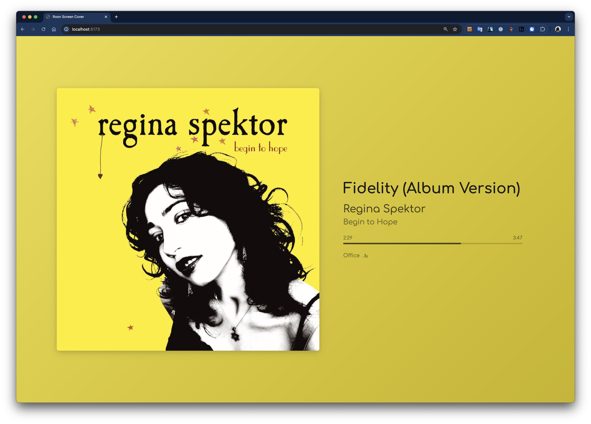
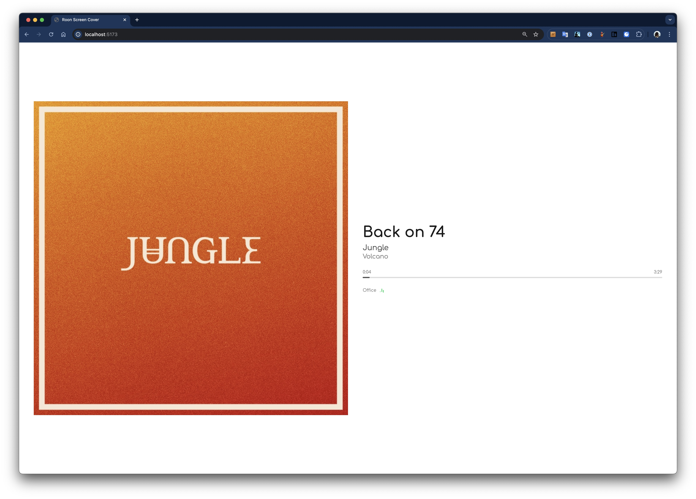
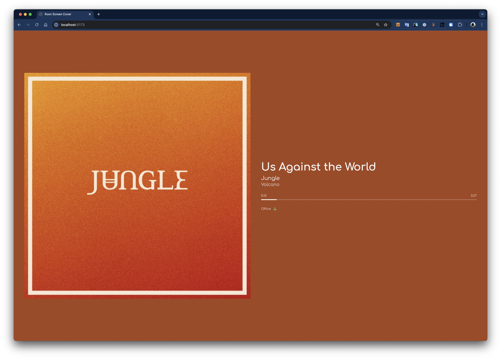
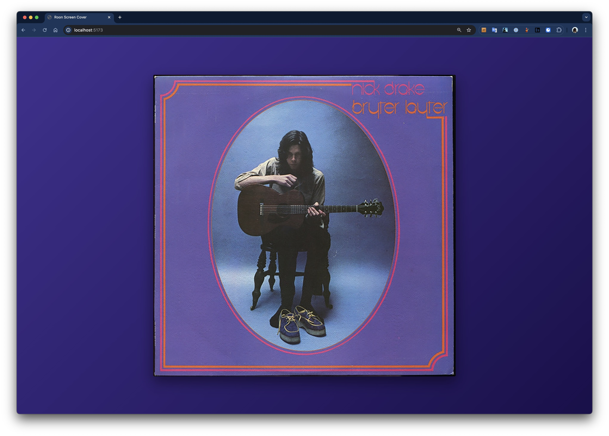

# Roon Now Playing

A now-playing display for Roon and other music sources. Shows real-time album artwork and track metadata on any web-connected client. Perfect for "always-on" displays like tablets and wall-mounted screens. Works with Roon, or in external-sources-only mode via API.

<p align="center">
  
</p>

## Features

- Real-time album artwork and track metadata display
- Multiple simultaneous clients viewing different zones
- Nine display layouts including AI-powered Facts layouts
- Fourteen background options with dynamic color extraction
- Seventeen customizable font families
- AI-generated facts about currently playing music (Anthropic/OpenAI/OpenRouter/Local LLM)
- **Self-service onboarding** — displays auto-generate friendly names and show QR codes linking to per-screen config
- Admin panel for managing connected clients and AI configuration
- **Roon optional** — set `ROON_ENABLED=false` to run in external-sources-only mode, no Roon required
- **External Sources API** for non-Roon music sources (see [External API Documentation](docs/external-api.md))
- Automatic zone selection via URL parameters
- WebSocket-based real-time updates
- Artwork caching for performance
- Auto-reconnect on connection loss
- Multi-platform Docker images (amd64, arm64)

## Quick Start

### Docker (Recommended)

```bash
docker compose up -d
```

Or pull the image directly:

```bash
docker pull ghcr.io/arthursoares/roon-now-playing:latest
```

Then open `http://localhost:3000` in your browser.

### Manual Installation

Requirements:
- Node.js 20+
- pnpm 8+

```bash
# Install dependencies
pnpm install

# Build all packages
pnpm build

# Start the server
pnpm start
```

For development with hot reload:

```bash
pnpm dev
```

## Usage

1. **First Launch**: Open `http://<server-ip>:3000` on your display
2. **Welcome Screen**: The display auto-generates a friendly name (e.g., `gentle-fox-17`) and shows a QR code
3. **Configure**: Scan the QR code from your phone to open the screen's config page, or visit `/admin`
4. **Select Zone**: Choose which zone to display (Roon zones auto-appear; external sources via API)
5. **Enjoy**: The display will update in real-time

> **Tip:** If using Roon, authorize the extension in Roon Settings → Extensions. To run without Roon, set `ROON_ENABLED=false` in your environment.

### URL Parameters

| Parameter | Values | Description |
|-----------|--------|-------------|
| `zone` | Zone name or ID | Auto-select zone (e.g., `?zone=Living%20Room`) |
| `layout` | `detailed`, `minimal`, `fullscreen`, `ambient`, `cover`, `facts-columns`, `facts-overlay`, `facts-carousel`, `basic` | Display layout |
| `background` | See [Backgrounds](#backgrounds) section | Background style |
| `font` | See [Fonts](#fonts) section | Font family |

Example: `http://localhost:3000/?zone=Office&layout=detailed&background=gradient-mesh&font=comfortaa`

### Interactions

- **Single Click**: Cycle through layouts
- **Double Click**: Change zone

## Layouts

| Layout | Description |
|--------|-------------|
| `detailed` | Album artwork alongside title, artist, album, and progress bar. Responsive two-column layout on wider screens. |
| `minimal` | Full-bleed artwork covering the entire screen with title/artist overlay at the bottom. Background setting is ignored. |
| `fullscreen` | Album artwork centered on screen, scaled to fit. No text overlays. |
| `ambient` | Color-extracted background with artwork and full track info. Great for 10-foot UI / TV displays. |
| `cover` | Clean album cover centered with subtle shadow. Artwork crossfades on track changes. |
| `facts-columns` | Two-column layout with artwork and AI-generated facts about the music. |
| `facts-overlay` | Full artwork background with facts overlaid at the bottom. |
| `facts-carousel` | Blurred artwork background with facts displayed in a centered card. |
| `basic` | Legacy-compatible layout for older browsers (iOS 12+). Artwork with title, artist, album, and progress bar. Auto-adapts to portrait/landscape. |

**Note:** Facts layouts require an LLM provider configured in the Admin panel. Supported providers: Anthropic, OpenAI, OpenRouter, or Local LLM (Ollama/LM Studio).

**Note:** The `basic` layout is designed for older browsers like iOS 12 Safari. It avoids modern CSS features (gap, aspect-ratio, backdrop-filter) for maximum compatibility on legacy devices used as dedicated displays.

### Screenshots

<table>
  <tr>
    <td align="center"><br><em>Detailed + Dominant Color</em></td>
    <td align="center"><br><em>Detailed + White</em></td>
  </tr>
  <tr>
    <td align="center"><br><em>Detailed + Dominant Color</em></td>
    <td align="center"><br><em>Cover + Radial Gradient</em></td>
  </tr>
</table>

## Backgrounds

Customize the background using the `?background=` URL parameter or via Admin UI:

### Basic
| Background | Description |
|------------|-------------|
| `black` | Pure black (#000000) - Default |
| `white` | Pure white (#ffffff) |
| `dominant` | Vibrant solid color extracted from album artwork |

### Gradients
| Background | Description |
|------------|-------------|
| `gradient-radial` | Radial gradient emanating from center using artwork colors |
| `gradient-linear` | Diagonal linear gradient (135°) using artwork colors |
| `gradient-linear-multi` | Multi-color linear gradient using full color palette |
| `gradient-radial-corner` | Radial gradient from corner using palette colors |
| `gradient-mesh` | CSS mesh gradient with colors at corners |

### Artwork-Based
| Background | Description |
|------------|-------------|
| `blur-subtle` | Softly blurred album artwork (20px blur) |
| `blur-heavy` | Heavily blurred album artwork (50px blur) |
| `duotone` | Album artwork with two-color duotone effect |
| `posterized` | Album artwork with reduced color posterization |

### Textured
| Background | Description |
|------------|-------------|
| `gradient-noise` | Gradient with subtle noise texture overlay |
| `blur-grain` | Blurred artwork with film grain effect |

**Note:** The `minimal` layout ignores background settings since the artwork covers the entire screen.

## Fonts

Customize the display font using the `?font=` URL parameter:

| Font | Description |
|------|-------------|
| `system` | System default font (default) |
| `patua-one` | Patua One - Bold slab serif |
| `comfortaa` | Comfortaa - Rounded geometric sans |
| `noto-sans-display` | Noto Sans Display - Clean sans-serif |
| `coda` | Coda - Friendly sans-serif |
| `bellota-text` | Bellota Text - Soft humanist sans |
| `big-shoulders` | Big Shoulders Display - Condensed display |
| `inter` | Inter - Modern UI font, highly legible |
| `roboto` | Roboto - Google's signature font |
| `open-sans` | Open Sans - Friendly and neutral |
| `lato` | Lato - Warm and stable |
| `montserrat` | Montserrat - Geometric elegance |
| `poppins` | Poppins - Clean geometric sans |
| `source-sans-3` | Source Sans 3 - Adobe's open source font |
| `nunito` | Nunito - Rounded and balanced |
| `raleway` | Raleway - Elegant thin weight |
| `work-sans` | Work Sans - Optimized for screens |

## Admin Panel

Access the admin panel at `/admin` to manage connected clients and configure AI features.

### Self-Service Onboarding
New displays automatically receive a memorable name (e.g., `calm-falcon-7`) and show a QR code linking to `/admin/screen/<name>`. Scanning the QR from a phone opens a focused config page for that specific display — no manual ID lookup needed.

### Per-Screen Config (`/admin/screen/:name`)
A mobile-friendly page for configuring a single display:
- Rename the screen
- Select zone
- Change layout, background, and font
- Settings are pushed to the display in real-time

### Client Management
- View all connected clients with their current settings
- Push layout, font, background, and zone changes to any client remotely
- Auto-generated friendly names (admin can rename anytime)
- Real-time updates when clients connect/disconnect

### Facts Configuration
Configure AI-powered facts generation for the facts layouts:
- Choose from four providers: Anthropic, OpenAI, OpenRouter, or Local LLM
- Select model from curated list or enter custom model name
- Set API key (or use environment variables)
- Configure local LLM base URL for Ollama/LM Studio
- Configure facts count per track (1-10)
- Customize rotation interval
- Test configuration with sample track data

## Configuration

Environment variables (or `.env` file):

| Variable | Default | Description |
|----------|---------|-------------|
| `PORT` | `3000` | HTTP server port |
| `HOST` | `0.0.0.0` | Server bind address |
| `ROON_ENABLED` | `true` | Set to `false` to disable Roon and run in external-sources-only mode |
| `ARTWORK_CACHE_DIR` | `./cache` | Artwork cache directory |
| `LOG_LEVEL` | `info` | Log level: `debug`, `info`, `warn`, `error` |
| `ANTHROPIC_API_KEY` | - | Anthropic API key for facts generation |
| `OPENAI_API_KEY` | - | OpenAI API key for facts generation |
| `OPENROUTER_API_KEY` | - | OpenRouter API key for facts generation |
| `LOCAL_LLM_URL` | `http://localhost:11434/v1` | Base URL for local LLM (Ollama/LM Studio) |

**Note:** API keys can also be configured via the Admin panel. Environment variables take precedence.

## LLM Providers

The facts feature supports multiple LLM providers for generating music facts:

### Anthropic (Default)
- Models: Claude Sonnet 4, Claude Haiku 4
- Requires: `ANTHROPIC_API_KEY` or API key in Admin panel
- Best for: High-quality, nuanced facts

### OpenAI
- Models: GPT-4o, GPT-4o-mini
- Requires: `OPENAI_API_KEY` or API key in Admin panel
- Best for: Fast, reliable generation

### OpenRouter
- Access 200+ models through a unified API
- Curated models: Llama 3.1, Mistral, Gemini, DeepSeek
- Custom model support: Enter any OpenRouter model ID
- Requires: `OPENROUTER_API_KEY` or API key in Admin panel
- Best for: Model variety, cost optimization
- Get an API key at [openrouter.ai](https://openrouter.ai)

### Local LLM (Ollama/LM Studio)
- Run models locally with no API costs
- Works with any OpenAI-compatible local server
- Requires: Local server running (e.g., Ollama, LM Studio)
- Configure base URL in Admin panel or via `LOCAL_LLM_URL`
- API key optional (only if your local server requires it)
- Best for: Privacy, offline use, cost savings

**Ollama Quick Start:**
```bash
# Install Ollama
curl -fsSL https://ollama.com/install.sh | sh

# Pull a model
ollama pull llama3.1

# Ollama runs on http://localhost:11434/v1 by default
```

**LM Studio Quick Start:**
1. Download LM Studio from [lmstudio.ai](https://lmstudio.ai)
2. Download a model (e.g., Llama 3.1, Mistral)
3. Start local server (default: `http://localhost:1234/v1`)
4. Configure the URL in Admin panel

## API

### HTTP Endpoints

| Method | Path | Description |
|--------|------|-------------|
| `GET` | `/api/zones` | List available zones |
| `GET` | `/api/artwork/:key` | Get cached/proxied artwork |
| `GET` | `/api/health` | Health check |

### Admin API

| Method | Path | Description |
|--------|------|-------------|
| `GET` | `/api/admin/clients` | List all connected clients |
| `GET` | `/api/admin/zones` | List available zones |
| `POST` | `/api/admin/clients/:id/name` | Set client friendly name |
| `POST` | `/api/admin/clients/:id/push` | Push settings to client (layout, font, background, zoneId) |
| `GET` | `/api/admin/screens/:name` | Get screen by friendly name |

### Facts API

| Method | Path | Description |
|--------|------|-------------|
| `GET` | `/api/facts/config` | Get current facts configuration |
| `POST` | `/api/facts/config` | Update facts configuration |
| `GET` | `/api/facts/:artist/:album/:title` | Get cached facts for a track |
| `POST` | `/api/facts/test` | Test facts generation with sample data |

### External Sources API

The External Sources API allows any music source to push now-playing data. External sources appear as zones alongside Roon zones.

| Method | Path | Description |
|--------|------|-------------|
| `POST` | `/api/sources/:zoneId/now-playing` | Push now-playing update |
| `DELETE` | `/api/sources/:zoneId` | Remove external zone |
| `GET` | `/api/sources` | List external zones |
| `GET` | `/api/sources/config` | Get API configuration |
| `POST` | `/api/sources/config` | Update API configuration |

For complete documentation with examples, see [External API Documentation](docs/external-api.md).

### WebSocket

Connect to `/ws` for real-time updates.

**Client → Server:**
```json
{ "type": "subscribe", "zone_id": "..." }
{ "type": "unsubscribe" }
{ "type": "client_metadata", "clientId": "...", "layout": "detailed", "font": "system", "background": "black", ... }
```

**Server → Client:**
```json
{ "type": "zones", "zones": [...] }
{ "type": "now_playing", "zone_id": "...", "state": "playing", "track": {...}, "seek_position": 0 }
{ "type": "seek", "zone_id": "...", "seek_position": 42 }
{ "type": "remote_settings", "layout": "minimal", "font": "comfortaa", "background": "gradient-radial" }
```

## Contributing

### Adding a New Layout

Layouts are Vue 3 single-file components in `packages/client/src/layouts/`. To create a new layout:

1. **Create the layout component** at `packages/client/src/layouts/YourLayout.vue`:

```vue
<script setup lang="ts">
import { computed } from 'vue';
import type { Track, PlaybackState, BackgroundType } from '@roon-screen-cover/shared';
import { useColorExtraction } from '../composables/useColorExtraction';
import { useBackgroundStyle } from '../composables/useBackgroundStyle';

const props = defineProps<{
  track: Track | null;
  state: PlaybackState;
  isPlaying: boolean;
  progress: number;
  currentTime: string;
  duration: string;
  artworkUrl: string | null;
  zoneName: string;
  background: BackgroundType;
}>();

// Optional: Use color extraction for dynamic backgrounds
const backgroundRef = computed(() => props.background);
const artworkUrlRef = computed(() => props.artworkUrl);
const { colors, vibrantGradient } = useColorExtraction(artworkUrlRef);
const { style: backgroundStyle } = useBackgroundStyle(backgroundRef, colors, vibrantGradient);
</script>

<template>
  <div class="your-layout" :style="backgroundStyle">
    <!-- Your layout design here -->
  </div>
</template>

<style scoped>
.your-layout {
  width: 100%;
  height: 100%;
  color: var(--text-color, #fff);
  transition: background 0.5s ease-out;
}
</style>
```

2. **Register the layout** in `packages/shared/src/index.ts`:

```typescript
export const LAYOUTS = ['detailed', 'minimal', 'fullscreen', 'ambient', 'cover', 'your-layout'] as const;
```

3. **Add to the layout switcher** in `packages/client/src/components/NowPlaying.vue`:

```typescript
import YourLayout from '../layouts/YourLayout.vue';

const layoutComponent = computed(() => {
  switch (props.layout) {
    // ... existing cases
    case 'your-layout':
      return YourLayout;
    default:
      return DetailedLayout;
  }
});
```

4. **Build and test**:

```bash
pnpm build
pnpm dev
# Open http://localhost:5173/?layout=your-layout
```

### Available Composables

| Composable | Purpose |
|------------|---------|
| `useColorExtraction(artworkUrl)` | Extract dominant colors from artwork for dynamic theming |
| `useBackgroundStyle(background, colors, vibrantGradient)` | Generate CSS styles for background types |
| `useNowPlaying(nowPlaying)` | Process now playing data with formatted times and progress |

### CSS Variables

When using `useBackgroundStyle`, these CSS variables are available:

| Variable | Description |
|----------|-------------|
| `--text-color` | Primary text color |
| `--text-secondary` | Secondary text color (80% opacity) |
| `--text-tertiary` | Tertiary text color (60% opacity) |
| `--progress-bar-bg` | Progress bar background |
| `--progress-bar-fill` | Progress bar fill color |

## Development

```bash
# Run in development mode (server + client with hot reload)
pnpm dev

# Type check
pnpm --filter @roon-screen-cover/client exec vue-tsc --noEmit

# Build for production
pnpm build

# Build Docker image locally
docker compose -f docker-compose.dev.yml up --build
```

## Project Structure

```
roon-now-playing/
├── packages/
│   ├── shared/              # Shared TypeScript types
│   │   └── src/index.ts     # Type definitions, constants
│   ├── server/              # Node.js backend
│   │   └── src/
│   │       ├── index.ts     # Entry point
│   │       ├── roon.ts      # Roon API client
│   │       ├── websocket.ts    # WebSocket handling
│   │       ├── artwork.ts      # Artwork cache
│   │       ├── admin.ts        # Admin API routes
│   │       ├── nameGenerator.ts # Friendly name generator
│   │       └── clientNames.ts  # Persistent name storage
│   └── client/              # Vue 3 frontend
│       └── src/
│           ├── views/
│           │   ├── NowPlayingView.vue
│           │   ├── AdminView.vue
│           │   └── ScreenConfigView.vue
│           ├── components/
│           │   ├── NowPlaying.vue
│           │   ├── ZonePicker.vue
│           │   └── ProgressBar.vue
│           ├── layouts/
│           │   ├── DetailedLayout.vue
│           │   ├── MinimalLayout.vue
│           │   ├── FullscreenLayout.vue
│           │   ├── AmbientLayout.vue
│           │   ├── CoverLayout.vue
│           │   ├── FactsColumnsLayout.vue
│           │   ├── FactsOverlayLayout.vue
│           │   ├── FactsCarouselLayout.vue
│           │   └── BasicLayout.vue
│           └── composables/
│               ├── useWebSocket.ts
│               ├── usePreferences.ts
│               ├── useColorExtraction.ts
│               ├── useBackgroundStyle.ts
│               ├── useFacts.ts
│               └── colorUtils.ts
├── .github/workflows/
│   └── docker-publish.yml
├── Dockerfile
├── docker-compose.yml
└── README.md
```

## Docker Images

Pre-built images are available from GitHub Container Registry:

```bash
# Latest from main branch
docker pull ghcr.io/arthursoares/roon-now-playing:latest

# Specific version
docker pull ghcr.io/arthursoares/roon-now-playing:1.3.0
```

Supported platforms:
- `linux/amd64`
- `linux/arm64`

## License

MIT
